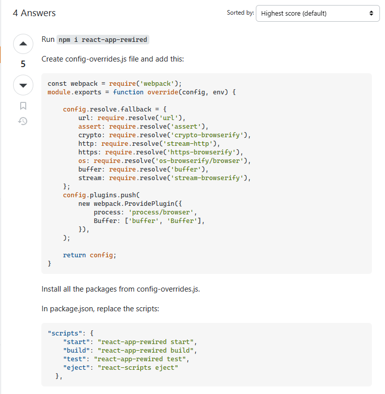

https://stackoverflow.com/questions/67348426/how-fix-breaking-change-webpack-5-used-to-include-polyfills-for-node-js-core#:~:text=If%20you%20want%20to%20include%20a%20polyfill%2C%20you,module%20like%20this%3A%20resolve.fallback%3A%20%7B%20%22stream%22%3A%20false%20%7D

